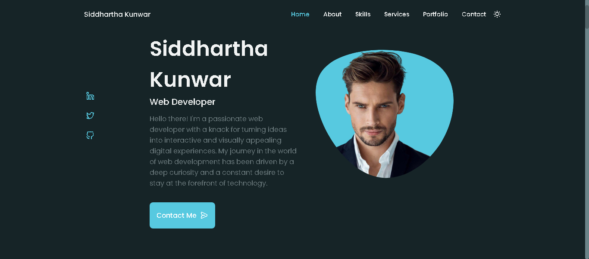

# 🚀 Personal Portfolio Website

A responsive and modern personal portfolio website built using **HTML**, **CSS**, and **JavaScript**.  
This project was developed as part of **CODSOFT Web Development Task-2** to showcase skills, projects, and professional information in a sleek and user-friendly interface.

## 🌐 Live Demo

👉 [View Live Site](https://x0lg0n.github.io/CODSOFT-Task-2/)

## 🖼️ Preview



## 📁 Features

- ✅ Responsive Design – Optimized for all devices
- ✅ Clean UI – Modern and elegant layout
- ✅ Interactive Sections:
  - Home
  - About
  - Skills
  - Qualification
  - Services
  - Portfolio
  - Project in Mind
  - Testimonials
  - Contact
  - Footer

## 🛠️ Technologies Used

- HTML5  
- CSS3  
- JavaScript

## 📂 Project Structure

```
Personal-Portfolio/
├── css/
│   └── [Stylesheets]
├── js/
│   └── [JavaScript Files]
├── images/
│   └── [Image Assets]
├── index.html
├── preview.png
└── README.md
```

## 🚀 Getting Started

To run this project locally:

```bash
git clone https://github.com/x0lg0n/Personal-Portfolio.git
cd Personal-Portfolio
```

Then open `index.html` in your browser.

## 📬 Contact

For feedback or collaboration:

- Email: [your.email@example.com](mailto:your.email@example.com)
- LinkedIn: [Your LinkedIn](https://www.linkedin.com/in/yourprofile)

---

Feel free to customize it to match your personal brand!
